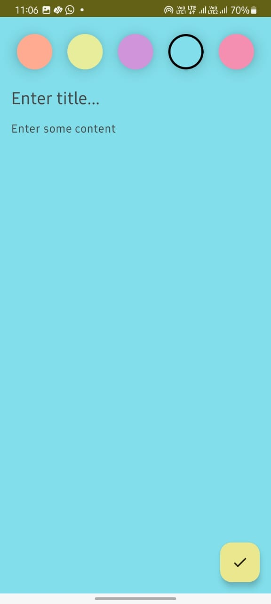
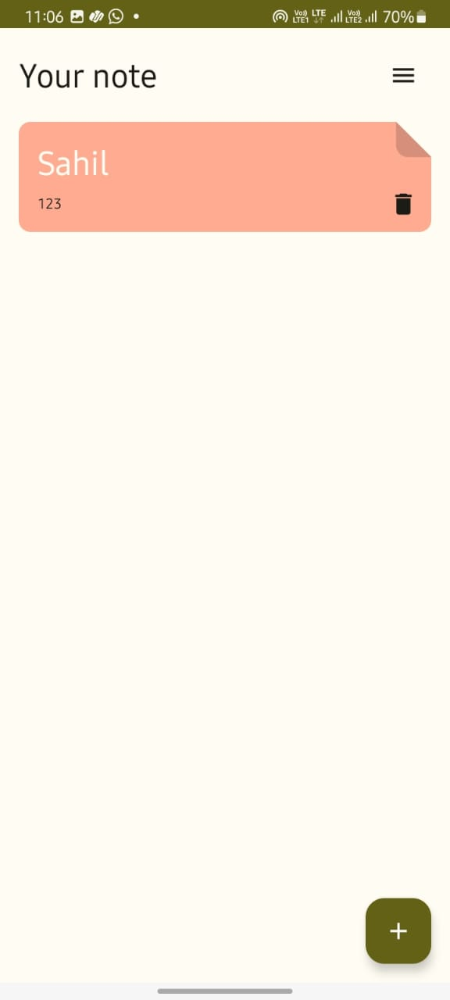
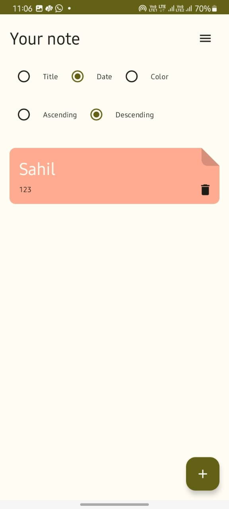

# NotesKeeper
An android app built using Jetpack Compose that uses the Room Database to store the daily To-do lists, important notes. It also provides the feature to sort the notes based on different factors such as Title, Date, Color in both ascending and descending scheme.

# Tech Stack
- [MVVM Architecture]- A software architecture that removes the tight coupling between components. Most importantly, in this architecture, the children don't have the direct reference to the parent, they only have the reference by observables.
- [Hilt]- Hilt provides a standard way to incorporate Dagger dependency injection into an Android application.
- [Jetpack Compose]- Modern toolkit for building native UI.
- [Android KTX]- Provide concise, idiomatic Kotlin to Jetpack and Android platform APIs.
- [Room]- Provides an abstraction layer over SQLite used for offline data caching.
- [ViewModel]- Designed to store and manage UI-related data in a lifecycle conscious way. The ViewModel class allows data to survive configuration changes such as screen rotations.
- [Coroutines]- Library Support for coroutines.
- [Flows]- Flows are built on top of coroutines and can provide multiple values. A flow is conceptually a stream of data that can be computed asynchronously.

# Screenshots

  
